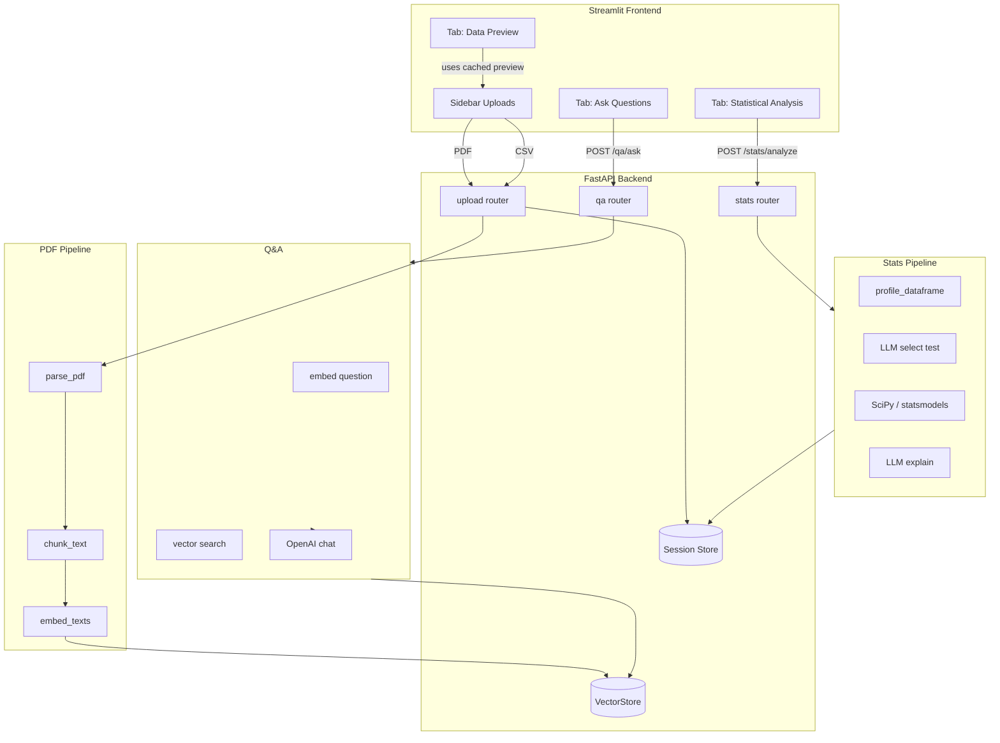

# Statistical Hypothesis Testing Assistant

Upload research **PDFs** and **CSV/XLSX datasets**, then ask questions in plain language. The app has two main capabilities:

1. **Document Q&A** — Ask questions about an uploaded research PDF (RAG over embedded text chunks).
2. **Statistical analysis** — Ask a question about your dataset; an LLM picks the right test, SciPy/statsmodels runs it, and the LLM explains the results in technical and plain language.

The UI is a **Streamlit** app; all heavy logic lives in a **FastAPI** backend. They communicate over HTTP on `localhost`.

---

## Table of contents

- [Architecture overview](#architecture-overview)
- [How the project is built](#how-the-project-is-built)
- [Startup: what happens when you run the app](#startup-what-happens-when-you-run-the-app)
- [Flow 1: PDF upload and Q&A](#flow-1-pdf-upload-and-qa)
- [Flow 2: Dataset upload and statistical analysis](#flow-2-dataset-upload-and-statistical-analysis)
- [Frontend (Streamlit) in detail](#frontend-streamlit-in-detail)
- [Backend modules reference](#backend-modules-reference)
- [API endpoints](#api-endpoints)
- [Supported statistical tests](#supported-statistical-tests)
- [Environment variables](#environment-variables)
- [Quick start](#quick-start)
- [Docker](#docker)

---

## Architecture overview

```
┌─────────────────────────────────────────────────────────────────────────┐
│  Browser  →  Streamlit (frontend/app.py)  :8501                          │
│                    │                                                     │
│                    │  HTTP (requests)                                    │
│                    ▼                                                     │
│  FastAPI (app_backend/main.py)  :8000                                   │
│    ├── /upload/pdf   → parser → chunker → embedder → VectorStore (FAISS) │
│    ├── /upload/csv   → pandas → session_store (in-memory DataFrame)      │
│    ├── /qa/ask       → QAEngine (RAG + OpenAI chat)                      │
│    └── /stats/analyze → stats_service (LLM select → SciPy → LLM explain) │
│                                                                          │
│  OpenAI API  (embeddings + chat completions)                             │
└─────────────────────────────────────────────────────────────────────────┘
```

| Layer | Technology | Role |
|-------|------------|------|
| Frontend | Streamlit | File uploads, tabs, chat UI, results display |
| API | FastAPI | REST endpoints, CORS, shared singletons |
| PDF pipeline | PyPDF2, chunker, OpenAI embeddings | Index document for search |
| Vector search | FAISS (or numpy fallback) | Similarity search over chunk embeddings |
| Data | pandas | Load CSV/XLSX, profile schema, run tests |
| Statistics | SciPy, statsmodels | Actual hypothesis tests |
| Intelligence | OpenAI (`gpt-4o-mini`, `text-embedding-3-small`) | Test selection, Q&A answers, explanations |

**Important design choices:**

- **Two separate pipelines** — PDF content never mixes with CSV stats; they share only the UI and backend process.
- **In-memory state** — PDF vectors live in a process-local `VectorStore`; datasets live in `session_store` keyed by `session_id`. Restarting the backend clears everything.
- **LLM does not run the math** — The model chooses *which* test and *which columns*; numeric work is done by SciPy/statsmodels so results are reproducible.

---

## How the project is built

The repo is a **Python monorepo** with a clear split:

```
stat-hypothesis-app/
├── frontend/
│   └── app.py                 # Streamlit UI (client only)
├── app_backend/
│   ├── main.py                # FastAPI app factory, wires routers + singletons
│   ├── config.py              # Loads .env, OpenAI and path settings
│   ├── models/schema.py       # Pydantic request/response models
│   ├── routers/               # Thin HTTP handlers
│   │   ├── upload.py          # POST /upload/pdf, /upload/csv
│   │   ├── qa.py              # POST /qa/ask
│   │   └── stats.py           # POST /stats/analyze
│   ├── services/              # Business logic
│   │   ├── parser.py          # PDF → text
│   │   ├── chunker.py         # Text → overlapping chunks
│   │   ├── embedder.py        # Text → OpenAI vectors
│   │   ├── qa_engine.py       # RAG question answering
│   │   └── stats_service.py   # Full stats pipeline
│   └── utils/
│       ├── vector_store.py    # FAISS / numpy vector DB
│       └── session_store.py   # session_id → DataFrame
├── requirements.txt
├── Dockerfile                 # Backend only (uvicorn)
├── .env.example
└── README.md
```

**Creation pattern:** `main.py` calls `create_app()`, which:

1. Enables CORS (so Streamlit can call the API from the browser’s perspective via the Python `requests` client — CORS mainly helps if you add a web SPA later).
2. Creates one shared `VectorStore` and one `QAEngine(store)`.
3. Injects them into upload/qa routers via `set_vector_store()` / `set_engine()`.
4. Mounts routers under `/upload`, `/qa`, `/stats`.

Routers stay thin: validate input, call a service, return a Pydantic model.

---

## Startup: what happens when you run the app

### 1. Start the backend

```bash
uvicorn app_backend.main:app --reload --port 8000
```

| Moment | What happens |
|--------|----------------|
| Process starts | `config.py` loads `.env` from the project root (`OPENAI_API_KEY`, models, limits). |
| `create_app()` runs | Logging goes to console and `app_debug.log`. |
| Singletons created | Empty `VectorStore` and `QAEngine` bound to it. |
| Routes registered | `/upload/*`, `/qa/*`, `/stats/*`, `GET /health`. |
| Server listens | API ready at `http://localhost:8000`. |

### 2. Start the frontend

```bash
streamlit run frontend/app.py
```

| Moment | What happens |
|--------|----------------|
| Streamlit loads `app.py` | Page config (title, wide layout, sidebar). |
| Session state initialized | Flags for PDF/CSV uploads, chat history, stats history, example questions. |
| UI renders | Header, sidebar uploaders, three tabs. |
| User actions | Each action calls `backend()` → HTTP to FastAPI on port 8000. |

Until both processes run, uploads and analysis will fail with a connection error in the UI.

---

## Flow 1: PDF upload and Q&A

Use this when you want to **chat with a research PDF** (methods, findings, definitions).

### Step-by-step: PDF upload

```
User picks PDF in sidebar
    → Streamlit POST /upload/pdf (multipart file)
        → upload.py: read bytes
        → parser.parse_pdf: PyPDF2 extracts text per page
        → chunker.chunk_text: ~1000-token chunks, 200 overlap, UUID per chunk
        → embedder.embed_texts: OpenAI embedding API for all chunks
        → vector_store.add: normalize vectors, store in FAISS IndexFlatIP
    → Response: { success, chunks_created, filename, message }
    → Frontend sets pdf_uploaded = True
```

| Step | File | Responsibility |
|------|------|----------------|
| Extract text | `parser.py` | `PdfReader` per page; fallback UTF-8 decode if PyPDF2 missing |
| Chunk | `chunker.py` | Word-based windows with overlap for RAG context continuity |
| Embed | `embedder.py` | Batch call to `text-embedding-3-small` (configurable) |
| Store | `vector_store.py` | L2-normalized vectors; cosine similarity via inner product |

### Step-by-step: Ask a question (RAG)

```
User types question in "Ask Questions" tab
    → Streamlit POST /qa/ask { question, top_k: 5 }
        → qa_engine.QAEngine.answer:
            1. embed_texts([question])  → query vector
            2. vector_store.query       → top_k chunks + scores
            3. Build CONTEXT string from chunk texts (truncate at OPENAI_MAX_CONTEXT_CHARS)
            4. OpenAI chat: system prompt + CONTEXT + QUESTION
        → Response: { answer, sources[{ id, text, score }] }
    → UI appends user + assistant messages to chat_history
    → Sources shown in expandable panels
```

| Moment | Detail |
|--------|--------|
| Retrieval | Only indexed PDF chunks are searched; no CSV data involved. |
| Generation | Temperature 0 for factual answers; cites source numbers when possible. |
| If no PDF indexed | Chat input disabled; tab shows info message. |

**Note:** Clicking “Remove PDF” in the sidebar only clears **frontend** session state. The backend `VectorStore` still holds vectors until the server restarts (there is no delete endpoint).

---

## Flow 2: Dataset upload and statistical analysis

Use this when you want **automated hypothesis testing** on tabular data.

### Step-by-step: CSV/XLSX upload

```
User picks CSV/XLSX in sidebar
    → Streamlit POST /upload/csv
        → upload.py: read bytes
        → pandas read_csv or read_excel (by extension)
        → session_store.create_session(df, filename) → UUID session_id
        → Build preview (first 5 rows), dtypes, column list
    → Response: { session_id, rows, columns, dtypes, preview, ... }
    → Frontend stores session_id, columns, dtypes, preview
    → generate_example_questions() runs (OpenAI or heuristic fallback)
```

| Moment | Detail |
|--------|--------|
| Session | `session_id` is required for every `/stats/analyze` call. |
| Memory | Full DataFrame kept in `_sessions` dict in the backend process. |
| New file | If filename changes, frontend re-uploads and resets example questions. |

### Step-by-step: Run statistical analysis

```
User enters question + clicks "Run Analysis"
    → Streamlit POST /stats/analyze { session_id, question }
        → stats.py: get_session(session_id) → DataFrame
        → stats_service.run_statistical_analysis(df, question):

            PHASE A — Understand the data
            profile_dataframe(df)
              → per column: dtype, nulls, unique count,
                numeric min/max/mean OR categorical sample values

            PHASE B — LLM selects test (temperature 0)
            select_test_via_llm(question, schema_profile)
              → JSON: { test, variables, rationale } OR { test: "unsupported", message, rationale }
              → Must be one of SUPPORTED_TESTS identifiers, or `unsupported` if no test fits

            PHASE C — Validate & run (no LLM)
            Validate column names exist
            TEST_RUNNERS[test_name](df, variables)
              → SciPy / statsmodels
              → p-value, statistic, additional_stats, assumption_checks

            PHASE D — LLM explains results
            explain_results_via_llm(...)
              → JSON: { interpretation, plain_explanation }
              → significant = p_value < alpha (default 0.05)

        → StatTestResult returned to frontend
    → UI shows test badge, significance, p-value, rationale,
       variables, assumption checks, technical + plain explanations
    → Result appended to stats_history
```

| Phase | Who decides | Output |
|-------|-------------|--------|
| A | Code (`profile_dataframe`) | Schema JSON for the LLM |
| B | LLM | Test name + column mapping + rationale |
| C | Code (SciPy) | Numeric test results |
| D | LLM | Human-readable interpretations |

**Example:** Question *“Is cholesterol different between disease groups?”* with numeric `cholesterol` and categorical `disease` → LLM may pick `independent_ttest` or `mann_whitney_u` → runner checks normality (Shapiro / D’Agostino) and Levene → returns means, Cohen’s d, p-value → LLM writes both technical and plain summaries.

---

## Frontend (Streamlit) in detail

The frontend is **not** a React/Vue SPA. It is a single script, `frontend/app.py`, that Streamlit re-runs top-to-bottom on each interaction.

### Configuration and HTTP helper

- `BACKEND_URL = "http://localhost:8000"` — change this if the API runs elsewhere.
- `backend(method, path, **kwargs)` wraps `requests` with 120s timeout, JSON parsing, and user-friendly errors if the API is down.

### Session state (the app’s “memory”)

| Key | Purpose |
|-----|---------|
| `pdf_uploaded`, `pdf_filename` | PDF tab enabled / label |
| `csv_session_id`, `csv_filename`, `csv_columns`, `csv_dtypes`, `csv_preview`, `csv_rows` | Dataset identity and preview |
| `chat_history` | Q&A messages `{role, content, sources?}` |
| `stats_history` | Past analyses for the expander list |
| `example_questions` | LLM-generated prompts for the stats tab |
| `stat_question` | Bound to the analysis text area |

Streamlit reruns the script when widgets change; state persists across reruns via `st.session_state`.

### Layout

1. **Custom CSS** — Header gradient, metric cards, significance colors, dark sidebar.
2. **Sidebar** — PDF uploader (optional), CSV/XLSX uploader, column expander, remove buttons.
3. **Three tabs**
   - **Ask Questions** — Chat UI over PDF (`st.chat_message`, `st.chat_input`).
   - **Statistical Analysis** — Example question buttons, text area, α selector, run button, rich results layout.
   - **Data Preview** — First rows and dtype table from upload response (no extra API call).

### Frontend-only logic

`generate_example_questions(columns, dtypes)` calls OpenAI **directly from the Streamlit process** (uses `OPENAI_API_KEY` from the environment) to suggest six dataset-specific questions. If that fails, it builds heuristic questions from numeric vs categorical columns.

This is separate from the stats pipeline on the backend but improves UX before the user runs an analysis.

### What the frontend does *not* do

- No local PDF parsing or statistics — everything goes through FastAPI.
- No authentication — local dev tool assumption.
- Removing a dataset/PDF in the UI does not call backend delete APIs (sessions/vectors remain until server restart).

---

## Backend modules reference

| Module | Role |
|--------|------|
| `main.py` | App entry, CORS, singleton wiring |
| `config.py` | `.env`, model names, token/context limits |
| `routers/upload.py` | Multipart file handling for PDF and CSV |
| `routers/qa.py` | Delegates to `QAEngine` |
| `routers/stats.py` | Loads session DataFrame, calls `run_statistical_analysis` |
| `services/parser.py` | PDF text extraction |
| `services/chunker.py` | Overlapping text chunks for RAG |
| `services/embedder.py` | OpenAI embedding batches |
| `services/qa_engine.py` | Retrieve chunks + generate answer |
| `services/stats_service.py` | Profile → select test → run → explain |
| `utils/vector_store.py` | FAISS `IndexFlatIP` or numpy dot-product fallback |
| `utils/session_store.py` | In-memory `session_id` → `{df, filename}` |
| `models/schema.py` | Pydantic contracts for API I/O |

---

## API endpoints

| Method | Endpoint | Description |
|--------|----------|-------------|
| `POST` | `/upload/pdf` | Upload PDF → chunk → embed → FAISS |
| `POST` | `/upload/csv` | Upload CSV/XLSX → `session_id` + metadata |
| `POST` | `/qa/ask` | RAG question over indexed PDFs |
| `POST` | `/stats/analyze` | LLM + SciPy analysis on session dataset (422 on invalid setup) |
| `GET` | `/health` | `{ "status": "ok" }` |

Interactive docs: `http://localhost:8000/docs` (Swagger UI).

---

## Supported statistical tests

The LLM must return one of these identifiers; the backend runs the matching SciPy/statsmodels code:

| Identifier | Display name |
|------------|--------------|
| `independent_ttest` | Independent Samples T-Test |
| `paired_ttest` | Paired Samples T-Test |
| `one_sample_ttest` | One-Sample T-Test |
| `pearson_correlation` | Pearson Correlation |
| `spearman_correlation` | Spearman Correlation |
| `simple_linear_regression` | Simple Linear Regression |
| `multiple_linear_regression` | Multiple Linear Regression |
| `logistic_regression` | Logistic Regression (binary outcome) |
| `chi_square` | Chi-Square Test of Independence |
| `one_way_anova` | One-Way ANOVA |
| `mann_whitney_u` | Mann-Whitney U Test |
| `kruskal_wallis` | Kruskal-Wallis Test |
| `wilcoxon_signed_rank` | Wilcoxon Signed-Rank Test |

Many parametric tests include **assumption checks** (e.g. Shapiro-Wilk normality, Levene’s equal variance) returned in `assumption_checks`.

---

## Environment variables

| Variable | Default | Description |
|----------|---------|-------------|
| `OPENAI_API_KEY` | — | **Required** for embeddings, Q&A, stats selection, and explanations |
| `OPENAI_CHAT_MODEL` | `gpt-4o-mini` | Chat completions |
| `OPENAI_EMBEDDING_MODEL` | `text-embedding-3-small` | Embeddings for RAG |
| `OPENAI_MAX_CONTEXT_CHARS` | `12000` | Max retrieved context length for Q&A |
| `OPENAI_MAX_OUTPUT_TOKENS` | `1500` | Max tokens for generated answers/explanations |
| `UPLOAD_DIR` | `/tmp/stat_app_uploads` | Created by config; uploads are mostly in-memory |

Copy `.env.example` to `.env` and set your API key before starting.

---

## Quick start

### 1. Create virtual environment in the project root folder

```bash
python -m venv myenv
```

### 2. Activate environment by running this command

```bash
./myenv/Scripts/Activate.ps1
```

### 3. Install dependencies

```bash
pip install -r requirements.txt
```

### 4. Create .env file in the root folder and specify all the environment variables mentioned in .env.examples and add OPENAI API KEY

### 3. Start the backend (terminal 1)

```bash
uvicorn app_backend.main:app --reload --port 8000
```

### 4. Start the frontend (terminal 2)

```bash
streamlit run frontend/app.py
```

Open **http://localhost:8501** in your browser.

### Typical usage

1. Upload a **CSV/XLSX** in the sidebar (required for statistical analysis).
2. Optionally upload a **PDF** for document Q&A.
3. Use **Statistical Analysis** tab: pick an example question or type your own → **Run Analysis**.
4. Use **Ask Questions** tab to query the PDF if you uploaded one.
5. Use **Data Preview** to inspect columns and sample rows.

---

## End-to-end diagram (both flows)



---

## Summary

| User goal | Upload | Endpoint | Core backend path |
|-----------|--------|----------|-------------------|
| Talk to a paper | PDF | `/upload/pdf` then `/qa/ask` | Parser → chunks → embeddings → FAISS → RAG |
| Test a hypothesis on data | CSV/XLSX | `/upload/csv` then `/stats/analyze` | Session → profile → LLM pick test → SciPy → LLM explain |

The Streamlit frontend orchestrates these flows, keeps UI state, and renders results; FastAPI owns data processing, vector search, and statistics. OpenAI is used for **language** tasks (selection, Q&A, explanation), not for computing p-values.
