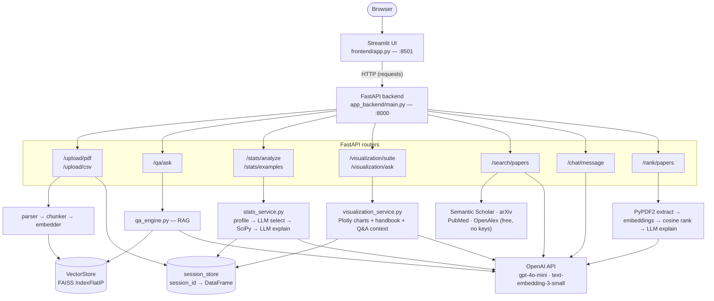

# Statistical Hypothesis Testing Assistant

A research tool for students and academics. Upload **PDFs** and **CSV/XLSX datasets**, ask questions in plain language, search across multiple academic databases, rank your literature by relevance, and chat with an AI about any hypothesis.

---

## Features

| Tab | What it does |
|-----|-------------|
| **Ask Questions** | Chat with an uploaded research PDF using RAG (retrieval-augmented generation) |
| **Statistical Analysis** | Describe a hypothesis in plain language — the AI picks the right test, SciPy runs it, the AI explains the results. Results come with an interactive Plotly chart suite (boxplot, violin, bell curve, histogram, scatter, correlation matrix, or contingency heatmap depending on the test), a plain-language caption and handbook per chart, and a mini chat to ask follow-up questions about any chart. Export to CSV or XLSX. |
| **Data Preview** | Inspect columns, types, and sample rows from your uploaded dataset |
| **Find Papers** | Enter a research question — searches Semantic Scholar, arXiv, PubMed, and OpenAlex in parallel and summarises the literature with an LLM |
| **Hypothesis Chat** | Chat about any hypothesis, scientific or wild — the AI engages thoughtfully and asks follow-up questions |
| **Rank Papers** | Upload up to 20 PDFs — the AI ranks them by relevance to your research question with explanations and key quotes. Export to Word or PDF. |

The UI is a **Streamlit** app; all heavy logic lives in a **FastAPI** backend. They communicate over HTTP on `localhost`.

---

## Table of contents

- [Architecture overview](#architecture-overview)
- [Project structure](#project-structure)
- [Startup](#startup)
- [Flow 1: PDF upload and Q&A](#flow-1-pdf-upload-and-qa)
- [Flow 2: Dataset upload and statistical analysis](#flow-2-dataset-upload-and-statistical-analysis)
- [Flow 3: Find Papers](#flow-3-find-papers)
- [Flow 4: Hypothesis Chat](#flow-4-hypothesis-chat)
- [Flow 5: Rank Papers](#flow-5-rank-papers)
- [Export options](#export-options)
- [Frontend session state](#frontend-session-state)
- [Backend modules reference](#backend-modules-reference)
- [API endpoints](#api-endpoints)
- [Supported statistical tests](#supported-statistical-tests)
- [Environment variables](#environment-variables)

---

## Architecture overview



*(Renders automatically on GitHub. A downloadable image is also kept at [`docs/architecture.png`](docs/architecture.png) — regenerate it after editing the diagram above with:*

```bash
awk '/^```mermaid$/{f=1;next} /^```$/{if(f){f=0;next}} f' README.md > /tmp/arch.mmd
npx @mermaid-js/mermaid-cli -i /tmp/arch.mmd -o docs/architecture.png
```

*Or paste the block into [mermaid.live](https://mermaid.live) to export SVG/PNG by hand.)*

| Layer | Technology | Role |
|-------|------------|------|
| Frontend | Streamlit | File uploads, tabs, chat UI, results display, export |
| API | FastAPI | REST endpoints, CORS, shared singletons |
| PDF pipeline | PyPDF2, chunker, OpenAI embeddings | Index document for search |
| Vector search | FAISS (or numpy fallback) | Similarity search over chunk embeddings |
| Data | pandas | Load CSV/XLSX, profile schema, run tests |
| Statistics | SciPy, statsmodels | Actual hypothesis tests |
| Visualization | Plotly (`graph_objects`) | Gauge, boxplot, violin, bell curve, histogram, scatter, correlation matrix, contingency heatmap |
| Intelligence | OpenAI (`gpt-4o-mini`, `text-embedding-3-small`) | Test selection, Q&A, explanations, summaries, chat, chart Q&A |
| Academic search | Semantic Scholar, arXiv, PubMed, OpenAlex APIs | Free paper search — no API keys required |
| Export | python-docx, reportlab, openpyxl | Word, PDF, XLSX file generation |

---

## Project structure

```
Hypothesis_App/
├── frontend/
│   └── app.py                  # Streamlit UI — all 6 tabs, export helpers
├── app_backend/
│   ├── main.py                 # FastAPI app factory, wires routers + singletons
│   ├── config.py               # Loads .env, OpenAI and path settings
│   ├── models/schema.py        # Pydantic request/response models
│   ├── routers/
│   │   ├── upload.py           # POST /upload/pdf, /upload/csv
│   │   ├── qa.py               # POST /qa/ask
│   │   ├── stats.py            # POST /stats/analyze, /stats/examples
│   │   ├── visualization.py    # POST /visualization/suite, /visualization/ask
│   │   ├── search.py           # POST /search/papers (multi-source academic search)
│   │   ├── chat.py             # POST /chat/message (hypothesis chatbot)
│   │   └── rank.py             # POST /rank/papers (PDF relevance ranking)
│   ├── services/
│   │   ├── parser.py           # PDF → text
│   │   ├── chunker.py          # Text → overlapping chunks
│   │   ├── embedder.py         # Text → OpenAI vectors
│   │   ├── qa_engine.py        # RAG question answering
│   │   ├── stats_service.py    # Profile → select test → run → explain
│   │   └── visualization_service.py  # Test result → Plotly chart suite +
│   │                                  # handbook + LLM chart Q&A context
│   └── utils/
│       ├── vector_store.py     # FAISS IndexFlatIP or numpy fallback
│       └── session_store.py    # session_id → DataFrame
├── requirements.txt
├── .env.example
└── README.md
```

---

## Startup

Both processes must run simultaneously.

### 1. Create and activate virtual environment

```bash
# Create
python -m venv myenv

# Activate (macOS / Linux)
source myenv/bin/activate

# Activate (Windows PowerShell)
./myenv/Scripts/Activate.ps1
```

### 2. Install dependencies

```bash
pip install -r requirements.txt
```

### 3. Set up environment variables

Copy `.env.example` to `.env` and add your OpenAI API key:

```
OPENAI_API_KEY=sk-...
```

### 4. Start the backend (Terminal 1)

```bash
uvicorn app_backend.main:app --reload --port 8000
```

### 5. Start the frontend (Terminal 2)

```bash
streamlit run frontend/app.py
```

Open **http://localhost:8501** in your browser.

### Restarting after changes

```bash
# Stop with Ctrl+C, then:
source myenv/bin/activate && streamlit run frontend/app.py
```

---

## Flow 1: PDF upload and Q&A

Use this to **chat with a research paper** — ask about methods, findings, definitions, or limitations.

```
User picks PDF in sidebar
    → POST /upload/pdf (multipart)
        → parser.py: PyPDF2 extracts text per page
        → chunker.py: ~1000-token chunks with 200-token overlap
        → embedder.py: OpenAI text-embedding-3-small for all chunks
        → vector_store.py: FAISS IndexFlatIP stores normalised vectors
    → pdf_uploaded = True in session state

User asks a question
    → POST /qa/ask { question, top_k: 5 }
        → embed question → cosine search → top_k chunks
        → OpenAI chat with retrieved context
    → Answer + source cards with relevance bars shown in chat
```

**Note:** Clicking "Remove PDF" clears frontend state only. Backend vectors persist until server restart.

---

## Flow 2: Dataset upload and statistical analysis

Use this for **automated hypothesis testing** on tabular data.

```
User picks CSV/XLSX in sidebar
    → POST /upload/csv
        → pandas read_csv / read_excel
        → session_store creates session_id → DataFrame
    → Preview, column types, and example questions shown

User types a question → "Run Analysis"
    → POST /stats/analyze { session_id, question }
        → Phase A: profile_dataframe (dtypes, nulls, uniques, ranges)
        → Phase B: LLM selects test + column mapping (temperature 0)
        → Phase C: SciPy / statsmodels runs the test
        → Phase D: LLM writes technical + plain-language explanation
    → Results: test badge, p-value, significance, rationale,
               variables used, assumption checks, interpretations
    → Result persisted in session state (survives reruns) and added
      to session history → exportable as CSV or XLSX

Result renders → POST /visualization/suite { session_id, test_name,
                                              variables_used, p_value, alpha }
    → visualization_service picks charts by test shape:
        • independent_ttest / one_way_anova → boxplot, violin plot,
          bell curves (per-group normal approximation), grouped histogram
        • pearson_correlation / simple_linear_regression → scatterplot
          with trend line, histograms, correlation matrix (all numeric cols)
        • chi_square → contingency heatmap
        • every suite always includes the p-value-vs-alpha gauge
    → Each chart returns: Plotly figure JSON, a data-grounded plain-language
      caption, and a general "handbook" entry (what it is / how to read it /
      when it's used)
    → Rendered as tabs, each with a "📖 Learn more" expander (handbook) and
      a "💬 Ask about this chart" expander

User asks a follow-up question in a chart's Q&A box
    → POST /visualization/ask { session_id, test_name, variables_used,
                                 chart_key, question, history, p_value, alpha }
        → describe_chart_context() rebuilds the concrete numbers behind
          that specific chart (group means/stds, r, contingency counts…)
        → OpenAI chat answers using only those numbers — grounded, not guessed
    → Answer appended to a per-chart conversation thread
```

| Phase | Who decides | Output |
|-------|-------------|--------|
| A | Code | Schema JSON |
| B | LLM | Test name + column mapping + rationale |
| C | SciPy | p-value, statistic, assumption checks |
| D | LLM | Human-readable interpretations |
| Visualization | Code (Plotly) | Chart suite + captions + handbook |
| Chart Q&A | LLM (grounded in real numbers) | Follow-up explanations per chart |

---

## Flow 3: Find Papers

Use this to **discover relevant academic papers** for a research question.

```
User types research question → selects sources → "Search Papers"
    → POST /search/papers { question, limit, sources }
        → LLM extracts focused search keywords (gpt-4o-mini)
        → Selected sources queried in parallel (ThreadPoolExecutor):
            • Semantic Scholar API (all fields, citation counts, open-access PDFs)
            • arXiv API (physics, math, CS, biology — parsed from Atom XML)
            • PubMed/NCBI eSearch + eSummary (medical & life sciences)
            • OpenAlex API (250M+ works; abstract reconstructed from inverted index)
        → Results deduplicated by DOI and normalised title
        → Sorted: papers with abstracts and high citations first
        → LLM generates a 3-5 sentence literature synthesis
    → UI shows: source badge, authors, year, citations, abstract,
                links (Semantic Scholar, PDF, DOI), LLM summary above list
```

All four sources are free — no API keys required.

---

## Flow 4: Hypothesis Chat

Use this to **explore any hypothesis conversationally** — scientific or completely wild.

```
User types a hypothesis (or picks a starter prompt)
    → POST /chat/message { message, history }
        → OpenAI chat with system prompt tuned for hypothesis engagement:
            • Serious hypotheses: evidence, plausibility, relevant science
            • Wild hypotheses: creative but informed exploration
            • Always ends with a follow-up question
        → Last 10 messages sent as history for context
    → Reply shown in chat; conversation continues
```

---

## Flow 5: Rank Papers

Use this to **rank your literature collection** by relevance to your thesis — saves time when deciding which papers to read first.

```
User uploads PDFs (up to 20) + types research question → "Rank Papers"
    → POST /rank/papers (multipart: files + question form field)
        → PyPDF2 extracts text from first 6 pages of each PDF (max 4000 chars)
        → OpenAI embeddings for question + all papers in one batch call
        → Cosine similarity computed per paper
        → LLM generates per-paper explanation (2 sentences) + key quote
        → Papers sorted highest → lowest similarity score
    → UI shows: colour-coded label, % match bar, explanation, key quote
                Top 3 expanded automatically
    → Exportable as Word (.docx) or PDF
```

**Relevance labels:**

| Label | Score range |
|-------|------------|
| Highly Relevant | ≥ 82% |
| Relevant | 70–81% |
| Somewhat Relevant | 55–69% |
| Less Relevant | < 55% |

---

## Export options

| Feature | Formats | What's included |
|---------|---------|-----------------|
| Statistical Analysis | CSV, XLSX | Question, test name, p-value, statistic, alpha, significance, variables, interpretation, plain explanation, rationale |
| Paper Rankings | Word (.docx), PDF | Title, research question, ranked papers with label, match %, explanation, key quote |

Export buttons appear automatically once results are available.

---

## Frontend session state

| Key | Purpose |
|-----|---------|
| `pdf_uploaded`, `pdf_filename` | PDF tab enabled / label |
| `csv_session_id`, `csv_filename`, `csv_columns`, `csv_dtypes`, `csv_preview`, `csv_rows` | Dataset identity and preview |
| `chat_history` | Q&A messages `{role, content, sources?}` |
| `stats_history` | Past analyses for history expander and export |
| `example_questions`, `stat_question` | Stats tab UI state |
| `last_stats_result` | Most recent analysis result, rendered unconditionally each run so it survives reruns triggered by unrelated widgets (e.g. a chart's "Ask" button) |
| `viz_chat_{ui_id}_{chart_key}` | Per-chart Q&A conversation thread; `ui_id` is a UUID stamped onto each result the first time it renders |
| `search_results`, `search_query_used`, `search_summary` | Find Papers results |
| `hyp_chat_history` | Hypothesis Chat conversation |
| `rank_results`, `rank_question` | Rank Papers results |

---

## Backend modules reference

| Module | Role |
|--------|------|
| `main.py` | App factory, CORS, singleton wiring, router mounting |
| `config.py` | `.env` loading, model names, token/context limits |
| `routers/upload.py` | Multipart PDF and CSV handling |
| `routers/qa.py` | Delegates to `QAEngine` |
| `routers/stats.py` | Loads session DataFrame, calls stats pipeline |
| `routers/visualization.py` | Loads session DataFrame, calls chart-suite builder / chart Q&A |
| `routers/search.py` | Keyword extraction, parallel multi-source search, deduplication, LLM summary |
| `routers/chat.py` | Hypothesis chatbot with conversation history |
| `routers/rank.py` | PDF text extraction, embedding, cosine ranking, LLM explanations |
| `services/parser.py` | PDF → text (PyPDF2) |
| `services/chunker.py` | Overlapping text chunks for RAG |
| `services/embedder.py` | OpenAI embedding batches |
| `services/qa_engine.py` | Retrieve chunks + generate answer |
| `services/stats_service.py` | Profile → LLM select → SciPy → LLM explain |
| `services/visualization_service.py` | Test result → Plotly chart suite, plain-language captions, chart handbook, and grounded context for chart Q&A |
| `utils/vector_store.py` | FAISS `IndexFlatIP` or numpy fallback |
| `utils/session_store.py` | In-memory `session_id` → `{df, filename}` |

---

## API endpoints

| Method | Endpoint | Description |
|--------|----------|-------------|
| `POST` | `/upload/pdf` | Upload PDF → chunk → embed → FAISS |
| `POST` | `/upload/csv` | Upload CSV/XLSX → `session_id` + metadata |
| `POST` | `/qa/ask` | RAG question over indexed PDF |
| `POST` | `/stats/analyze` | LLM + SciPy analysis on session dataset |
| `POST` | `/stats/examples` | Generate example questions for a dataset |
| `POST` | `/visualization/suite` | Build the Plotly chart suite + captions + handbook for a result |
| `POST` | `/visualization/ask` | Answer a follow-up question about one chart, grounded in its real numbers |
| `POST` | `/search/papers` | Multi-source academic paper search |
| `POST` | `/chat/message` | Hypothesis chatbot turn |
| `POST` | `/rank/papers` | Rank uploaded PDFs by relevance to a question |
| `GET` | `/health` | `{ "status": "ok" }` |

Interactive docs: **http://localhost:8000/docs**

---

## Supported statistical tests

Only **active** tests are selectable by the LLM (`SUPPORTED_TESTS` in `stats_service.py`) and get a visualization suite. The rest are implemented but disabled — commented out of the active list — and are listed here for reference.

| Identifier | Display name | Status | Visualization suite |
|------------|--------------|--------|----------------------|
| `independent_ttest` | Independent Samples T-Test | Active | boxplot, violin, bell curve, histogram |
| `pearson_correlation` | Pearson Correlation | Active | scatterplot, histograms, correlation matrix |
| `simple_linear_regression` | Simple Linear Regression | Active | scatterplot, histograms, correlation matrix |
| `chi_square` | Chi-Square Test of Independence | Active | contingency heatmap |
| `one_way_anova` | One-Way ANOVA | Active | boxplot, violin, bell curve, histogram |
| `paired_ttest` | Paired Samples T-Test | Inactive | — |
| `one_sample_ttest` | One-Sample T-Test | Inactive | — |
| `spearman_correlation` | Spearman Correlation | Inactive | — |
| `multiple_linear_regression` | Multiple Linear Regression | Inactive | — |
| `logistic_regression` | Logistic Regression (binary outcome) | Inactive | — |
| `mann_whitney_u` | Mann-Whitney U Test | Inactive | — |
| `kruskal_wallis` | Kruskal-Wallis Test | Inactive | — |
| `wilcoxon_signed_rank` | Wilcoxon Signed-Rank Test | Inactive | — |

Every active test also gets the p-value-vs-alpha gauge. Parametric tests include assumption checks (Shapiro-Wilk normality, Levene's equal variance) returned in the result.

---

## Environment variables

| Variable | Default | Description |
|----------|---------|-------------|
| `OPENAI_API_KEY` | — | **Required** — used for embeddings, Q&A, stats, search summaries, chat, and ranking |
| `OPENAI_CHAT_MODEL` | `gpt-4o-mini` | Chat completions model |
| `OPENAI_EMBEDDING_MODEL` | `text-embedding-3-small` | Embeddings for RAG and paper ranking |
| `OPENAI_MAX_CONTEXT_CHARS` | `12000` | Max retrieved context length for Q&A |
| `OPENAI_MAX_OUTPUT_TOKENS` | `1500` | Max tokens for generated answers/explanations |
| `UPLOAD_DIR` | `/tmp/stat_app_uploads` | Upload directory (created automatically) |
